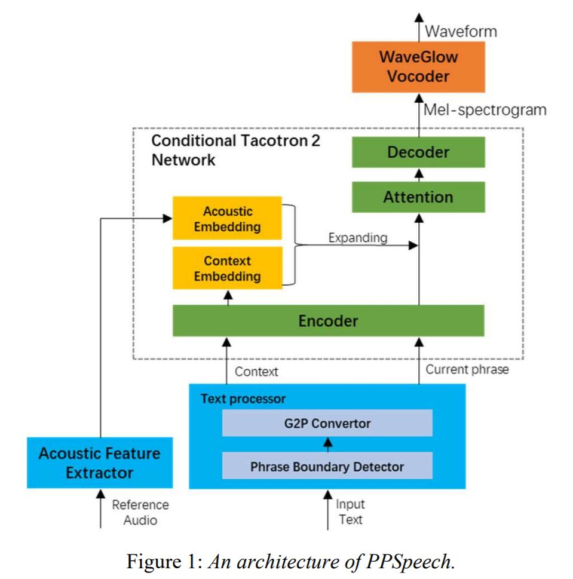

# PPSpeech: Phrase based Parallel End-to-End TTS System
Pytorch implementation of [PPSpeech: Phrase based Parallel End-to-End TTS System](https://arxiv.org/ftp/arxiv/papers/2008/2008.02490.pdf).


## Requirements :
All code written in `Python 3.6.2` .
* Install Pytorch
> Before installing pytorch please check your Cuda version by running following command : 
`nvcc --version`
```buildoutcfg
pip install torch torchvision
```

* Installing other requirements :
```buildoutcfg
pip install -r requirements.txt
```

* To use Tensorboard install `tensorboard version 1.14.0` seperatly with supported `tensorflow (1.14.0)`

### Note:
* In the paper author break a single sentence into phrases by predicting  intonation phrase boundaries(L3) using an expanded CRF supporting dynamic features. 
* But in this repo for sake of simplicity I divide sentence into phrases by randomly grouping the words together, 
which definitely not a true prosodic boundaries, which ultimately hurt the quality for text to speech.But it's don't bother me as I code this repo for just experimentation.
* For better quality use some smart/AI based Phase Boundry detection algo as author used in paper.

### Pre-processing
```buildoutcfg
python preprocessing.py -d path_of_wavs --config configs\default.yaml
```
### Training
```buildoutcfg
python train.py -o checkpoints -l logs --name "first" --config configs\default.yaml
```

### Inference
```buildoutcfg
python inference.py  -c "checkpoints\first\checkpoint_first_32000.pyt" -r "LJ002-0321.npy" --text put_your_text_here --config "configs\default.yaml" --name wave_file_name --mode 1
```

## References
- [PPSpeech's research paper](https://arxiv.org/ftp/arxiv/papers/2008/2008.02490.pdf)
- [ESPnet](https://github.com/espnet/espnet)
- [Nvidia's Tacotron 2](https://github.com/NVIDIA/tacotron2)
- [Mellotron](https://github.com/NVIDIA/mellotron)
